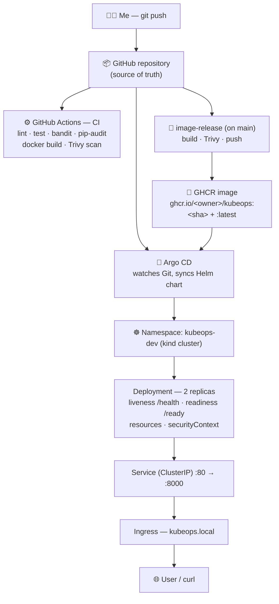
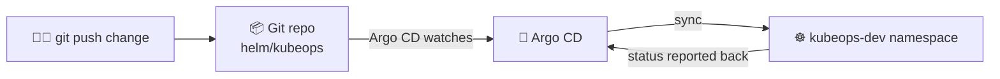
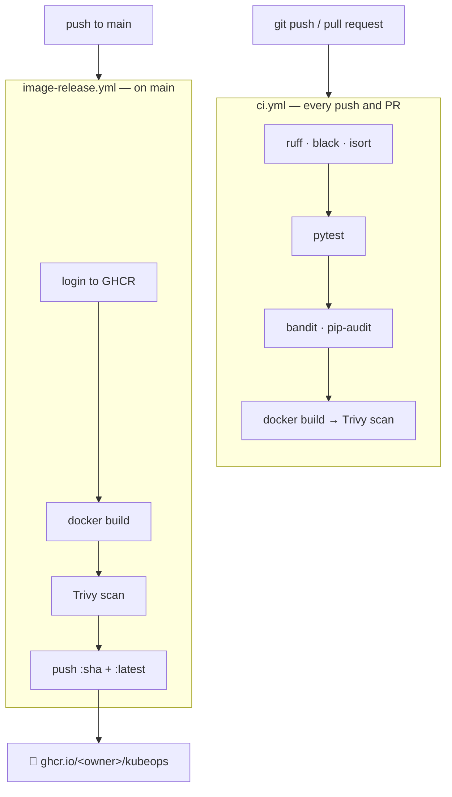

# KubeOps — A GitOps-Based Kubernetes Deployment Platform

[](https://github.com/your-username/kubeops-gitops/actions/workflows/ci.yml)
[](https://github.com/your-username/kubeops-gitops/actions/workflows/image-release.yml)


> **KubeOps** is a **production-style Kubernetes and GitOps portfolio project**
> built around a simple containerized FastAPI service (**KubeNotes API**). The
> app is intentionally small — the real focus is the **DevOps and platform
> work** around it: Docker, Kubernetes, Helm, GitHub Actions, GHCR, and an
> Argo CD GitOps setup.

I built this as a **junior DevOps / Cloud / Platform Engineering** portfolio
project. To be clear about scope: it's a *production-style* delivery and
deployment setup, **not** a full enterprise SaaS product. Every limitation is
listed openly near the end.

---

## Table of contents

- [Why I built this](#why-i-built-this)
- [Architecture](#architecture)
- [The tech I used](#the-tech-i-used)
- [The API endpoints](#the-api-endpoints)
- [Repository structure](#repository-structure)
- [Quickstart](#quickstart)
- [1. Run it locally (Python)](#1-run-it-locally-python)
- [2. Run it with Docker](#2-run-it-with-docker)
- [3. Deploy to Kubernetes with raw YAML](#3-deploy-to-kubernetes-with-raw-yaml)
- [4. Deploy with Helm](#4-deploy-with-helm)
- [5. GitOps with Argo CD](#5-gitops-with-argo-cd)
- [The CI/CD pipelines](#the-cicd-pipelines)
- [Helper scripts (PowerShell)](#helper-scripts-powershell)
- [Monitoring](#monitoring)
- [Security](#security)
- [Tests & quality checks](#tests--quality-checks)
- [What I learned](#what-i-learned)
- [Limitations (being honest)](#limitations-being-honest)
- [Future improvements](#future-improvements)
- [Deeper docs](#deeper-docs)
- [Resume bullet points](#resume-bullet-points)
- [License](#license)

---

## Why I built this

A lot of beginner projects stop at *"it runs on my laptop."* I wanted to show
the part that platform teams actually care about: how you take a containerized
app and run it on **Kubernetes** the GitOps way — where **Git is the single
source of truth**, and a controller (Argo CD) keeps the cluster matching what's
in the repo.

So I kept the app tiny — a notes API with in-memory storage — and put a real
Kubernetes + GitOps workflow around it. The question this project answers is:

> *"How do I package a simple API and run it on Kubernetes with Helm, GitOps,
> CI/CD, health checks, and security baked in?"*

Every push runs tests, linting, and security scans. Every push to `main` builds
and publishes a container image to GHCR. Deployment to the cluster is driven by
**Argo CD** syncing the Helm chart from Git.

---

## Architecture



**In words:** I push code to GitHub. CI checks it on every push and pull
request. On `main`, the image-release workflow builds the container, scans it
with Trivy, and pushes it to GitHub Container Registry. Argo CD watches the repo
and deploys the Helm chart into the `kubeops-dev` namespace on my local **kind**
cluster, where the app runs as a 2-replica Deployment behind a Service and
Ingress, with health probes and resource limits.

---

## The tech I used

| Area              | Choice                                                       |
| ----------------- | ------------------------------------------------------------ |
| Language          | Python 3.12                                                  |
| Web framework     | FastAPI + Uvicorn + Pydantic                                 |
| Storage           | In-memory (resets when the pod restarts — by design)         |
| Tests             | pytest + httpx                                               |
| Lint / format     | ruff, black, isort                                           |
| Security          | bandit (code), pip-audit (deps), Trivy (image)               |
| Container         | Docker (`python:3.12-slim`, non-root, healthcheck)           |
| Local dev         | Docker Compose                                               |
| Orchestration     | Kubernetes on **kind** (local cluster `dev`)                 |
| Packaging         | Helm chart (dev / prod values)                               |
| GitOps            | Argo CD `Application` manifest                               |
| CI/CD             | GitHub Actions                                               |
| Registry          | GitHub Container Registry (ghcr.io)                          |
| Scripts           | PowerShell (Windows-friendly)                                |

---

## The API endpoints

**KubeNotes API** — a simple notes service. Storage is **in-memory**, so data
resets when the pod restarts (this is intentional; the focus is Kubernetes, not
database design).

| Method   | Path           | Description                                   |
| -------- | -------------- | --------------------------------------------- |
| `GET`    | `/health`      | Liveness check → `{"status":"ok"}`            |
| `GET`    | `/ready`       | Readiness check → `{"status":"ready"}`        |
| `GET`    | `/notes`       | List all notes                                |
| `POST`   | `/notes`       | Create a note (validated)                     |
| `GET`    | `/notes/{id}`  | Get one note (404 if missing)                 |
| `PUT`    | `/notes/{id}`  | Update a note (404 if missing)                |
| `DELETE` | `/notes/{id}`  | Delete a note (404 if missing)                |

**Validation rules:** title is required and non-empty, title max 100 chars,
content max 1000 chars. FastAPI also gives interactive docs at `/docs`.

---

## Repository structure

```text
kubeops-gitops/
├── app/                      # FastAPI application
│   ├── main.py               # app + routes (health, ready, notes CRUD)
│   ├── models.py             # Pydantic models + validation
│   └── settings.py           # config from environment variables
│
├── tests/                    # pytest suite
│   ├── test_health.py        # /health and /ready
│   ├── test_notes.py         # full CRUD flow
│   └── test_validation.py    # bad input is rejected
│
├── k8s/                      # raw Kubernetes manifests
│   ├── namespace.yaml        # kubeops-dev
│   ├── configmap.yaml        # APP_ENV, LOG_LEVEL
│   ├── secret.example.yaml   # placeholder secret (example only)
│   ├── deployment.yaml       # 2 replicas, probes, resources, securityContext
│   ├── service.yaml          # ClusterIP :80 → :8000
│   └── ingress.yaml          # host kubeops.local
│
├── helm/kubeops/             # Helm chart (same resources, configurable)
│   ├── Chart.yaml
│   ├── values.yaml           # defaults
│   ├── values-dev.yaml       # dev overrides
│   ├── values-prod.yaml      # prod overrides
│   └── templates/            # deployment, service, ingress, configmap,
│                             # secret, serviceaccount, _helpers.tpl
│
├── argocd/
│   └── application.yaml       # Argo CD Application (points at this repo)
│
├── monitoring/               # monitoring notes + dashboard guide
├── scripts/                  # PowerShell helper scripts (see below)
├── docs/                     # architecture, kubernetes, helm, gitops,
│                             # monitoring, security, troubleshooting
├── .github/workflows/
│   ├── ci.yml                # runs on push + PR
│   └── image-release.yml     # builds + pushes image on main
│
├── Dockerfile                # non-root, healthchecked image
├── docker-compose.yml        # local dev
├── requirements.txt          # app deps
├── requirements-dev.txt      # dev/test/lint/security tools
├── pyproject.toml            # tool config
├── .dockerignore
├── .env.example
├── LICENSE
└── README.md                 # you're reading it
```

---

## Quickstart

> Built and tested on **Windows** with Docker Desktop, kubectl, kind, and Helm,
> using a local kind cluster named `dev`.

```powershell
# 0. check your tools are ready
./scripts/check-tools.ps1

# 1. Python: set up, test, run
python -m venv .venv
.venv\Scripts\Activate.ps1
pip install -r requirements-dev.txt
python -m pytest
uvicorn app.main:app --reload      # http://localhost:8000/docs

# 2. Docker
docker build -t kubeops:local .
docker run -d --name kubeops-test -p 8000:8000 kubeops:local
curl http://localhost:8000/health
docker rm -f kubeops-test

# 3. Kubernetes (Helm) on your kind cluster
helm lint ./helm/kubeops
helm install kubeops ./helm/kubeops -n kubeops-dev --create-namespace -f helm/kubeops/values-dev.yaml
kubectl get pods -n kubeops-dev
kubectl port-forward svc/kubeops 8000:80 -n kubeops-dev
curl http://localhost:8000/health
```

---

## 1. Run it locally (Python)

You'll need **Python 3.12**.

```powershell
python -m venv .venv
.venv\Scripts\Activate.ps1            # Windows PowerShell
# source .venv/bin/activate           # macOS / Linux
pip install -r requirements-dev.txt

python -m pytest                      # run the tests
uvicorn app.main:app --reload         # dev server on :8000
```

Then open `http://localhost:8000/docs` for the interactive API, or:

```powershell
curl http://localhost:8000/health     # {"status":"ok"}
curl http://localhost:8000/ready      # {"status":"ready"}
```

---

## 2. Run it with Docker

The image uses `python:3.12-slim`, runs as a **non-root user**, exposes port
**8000**, and serves the app with Uvicorn.

```powershell
docker build -t kubeops:local .
docker run -d --name kubeops-test -p 8000:8000 kubeops:local
curl http://localhost:8000/health
docker rm -f kubeops-test
```

Or use Compose for local development:

```powershell
docker compose up --build             # http://localhost:8000/health
```

---

## 3. Deploy to Kubernetes with raw YAML

This applies the plain manifests in `k8s/` to your kind cluster. Good for seeing
exactly what Kubernetes objects are created before Helm hides them behind
templates.

```powershell
kubectl apply -f k8s/
kubectl get pods,svc,ingress -n kubeops-dev

# wait until pods are Running and Ready, then:
kubectl port-forward svc/kubeops 8000:80 -n kubeops-dev
curl http://localhost:8000/health
```

What you get: a `kubeops-dev` namespace, a **2-replica Deployment** with a
**livenessProbe** on `/health` and a **readinessProbe** on `/ready`, resource
**requests/limits**, a hardened **securityContext** (non-root, no privilege
escalation), config from a **ConfigMap**, a placeholder **Secret**, a
**ClusterIP Service** (`:80 → :8000`), and an **Ingress** for `kubeops.local`.

---

## 4. Deploy with Helm

The Helm chart produces the same resources but makes everything configurable —
replica count, image repo/tag, pull policy, service port, ingress host,
resources, env vars, and secrets — through `values.yaml` and the dev/prod
overrides.

```powershell
helm lint ./helm/kubeops
helm template kubeops ./helm/kubeops -f helm/kubeops/values-dev.yaml   # preview

helm install kubeops ./helm/kubeops -n kubeops-dev --create-namespace -f helm/kubeops/values-dev.yaml
kubectl get pods -n kubeops-dev

helm upgrade kubeops ./helm/kubeops -n kubeops-dev -f helm/kubeops/values-dev.yaml   # apply changes
helm uninstall kubeops -n kubeops-dev                                                # tear down
```

More detail in [docs/helm.md](docs/helm.md).

---

## 5. GitOps with Argo CD

In GitOps, **Git is the source of truth** and Argo CD continuously makes the
cluster match the repo. This project ships the Argo CD `Application` manifest;
installing Argo CD itself is a documented later step (it isn't installed
automatically).



The `argocd/application.yaml` points Argo CD at this repo's `helm/kubeops` path,
`main` revision, and the `kubeops-dev` namespace, using **manual sync by
default** for safety (automated sync is documented as an opt-in).

```powershell
# after Argo CD is installed in your cluster:
kubectl apply -f argocd/application.yaml
# then sync from the Argo CD UI or CLI:  argocd app sync kubeops
```

> ⚠️ Update the `repoURL` in `argocd/application.yaml` to your real repository
> URL before applying. Full walkthrough in [docs/gitops.md](docs/gitops.md).

---

## The CI/CD pipelines



**`ci.yml`** runs on every push and pull request: format checks (`black`,
`isort`), lint (`ruff`), tests (`pytest`), code security (`bandit`), dependency
audit (`pip-audit`), then a Docker build and a **Trivy image scan**. If anything
fails, the run fails.

**`image-release.yml`** runs on push to `main` (and `workflow_dispatch`): logs
in to GHCR, builds the image, scans it with Trivy, and pushes it tagged with both
the **commit SHA** and **`latest`**. It uses `permissions: { contents: read,
packages: write }` and the lowercase image name `ghcr.io/<owner>/kubeops`.

Details in [docs/gitops.md](docs/gitops.md) and the workflow files themselves.

---

## Helper scripts (PowerShell)

Because I'm on Windows, the `scripts/` folder is PowerShell-first and
beginner-friendly:

| Script                      | What it does                                             |
| --------------------------- | -------------------------------------------------------- |
| `check-tools.ps1`           | Verifies Docker, kubectl, kind, Helm, context, and nodes |
| `create-kind-cluster.ps1`   | Creates the `dev` kind cluster if it's missing           |
| `deploy-k8s.ps1`            | Applies the raw `k8s/` manifests and shows resources     |
| `deploy-helm.ps1`          | Lints + installs/upgrades the Helm chart                 |
| `check-health.ps1`         | Port-forwards and checks `/health`                       |
| `port-forward.ps1`         | Port-forwards `svc/kubeops` to localhost                 |
| `cleanup.ps1`              | Uninstalls the release / deletes resources (keeps cluster)|

---

## Monitoring

For a project at this level, monitoring is built on Kubernetes-native signals:

- **`/health`** (liveness) and **`/ready`** (readiness) endpoints, wired to the
  Kubernetes **livenessProbe** and **readinessProbe**.
- Logs to **stdout**, so `kubectl logs` works out of the box.
- Useful commands: `kubectl describe pod`, `kubectl get events`,
  `kubectl top pod`.

**Prometheus / Grafana** are documented as the next step (with a note on what
dashboards and a `/metrics` endpoint would look like) rather than installed.
See [docs/monitoring.md](docs/monitoring.md).

---

## Security

What's implemented:

- **No real secrets in the repo** — only `secret.example.yaml` and
  `.env.example` with placeholders; the real `.env` is git-ignored.
- **Non-root container** with a healthcheck in the Dockerfile.
- **Kubernetes securityContext**: `runAsNonRoot`, `runAsUser: 1000`,
  `allowPrivilegeEscalation: false` (and `readOnlyRootFilesystem` where it
  works).
- **Resource requests and limits** on the Deployment.
- **Scanning** at three layers: `bandit` (code), `pip-audit` (dependencies),
  `Trivy` (image).
- **GitHub Secrets + GHCR** for credentials in CI/CD.

Full details and the honest gaps are in [docs/security.md](docs/security.md).

---

## Tests & quality checks

Run everything locally before you push:

```powershell
python -m pytest                  # API + CRUD + validation tests
ruff check .                      # lint
black --check .                   # format check
isort --check-only .              # import order
bandit -r app                     # code security scan
pip-audit -r requirements.txt     # dependency vulnerability audit
```

The test suite covers `/health`, `/ready`, an initially empty list, creating
notes, rejecting empty / too-long titles and too-long content, getting and
updating existing and missing notes (404), and deleting existing and missing
notes (404).

---

## What I learned

- How **GitOps** works in practice, and why having Git as the single source of
  truth makes deployments repeatable and auditable.
- Writing **Kubernetes manifests** from scratch — Deployments, Services,
  Ingress, ConfigMaps, Secrets, probes, resources, and securityContext.
- Turning raw manifests into a reusable, configurable **Helm chart** with
  separate dev and prod values.
- Setting up **Argo CD** to deploy a Helm chart and how manual vs automated sync
  and rollback behave.
- Building **CI/CD** with GitHub Actions and publishing images to **GHCR**.
- Layering **security scanning** across code, dependencies, and image.
- Running and debugging workloads on a local **kind** cluster.

---

## Limitations (being honest)

I'd rather be upfront about the scope:

- The API is **intentionally simple**, and **data is stored in memory** — it
  resets every time the pod restarts.
- The focus is **Kubernetes / GitOps**, not application or database complexity.
- A local **kind** cluster is **not** the same as managed cloud Kubernetes
  (EKS / GKE / AKS).
- **No authentication** is implemented.
- **No HTTPS** is configured by default.
- **Argo CD manifests are provided**, but installing Argo CD is a later,
  documented step.
- **Monitoring is documented at a basic level** and is meant to be expanded.

---

## Future improvements

- Persistent storage (PostgreSQL via StatefulSet or a managed database).
- A Prometheus `/metrics` endpoint and a Grafana dashboard JSON.
- Argo CD **Image Updater** for automatic image rollouts.
- **cert-manager** for HTTPS and an **External Secrets Operator**.
- **Horizontal Pod Autoscaler** and **NetworkPolicies**.
- **Terraform** to provision a real cloud Kubernetes cluster.
- **Loki** for logs, **Cosign** for image signing, **Dependabot** for updates.
- Policy checks with **kube-score** / **kube-linter**.

---

## Deeper docs

The `docs/` folder goes deeper on each topic:

- [docs/architecture.md](docs/architecture.md) — app, Docker, Kubernetes, Helm,
  and GitOps flow.
- [docs/kubernetes.md](docs/kubernetes.md) — every Kubernetes object explained,
  plus useful `kubectl` commands.
- [docs/helm.md](docs/helm.md) — chart structure, values, install/upgrade/
  rollback/uninstall.
- [docs/gitops.md](docs/gitops.md) — what GitOps is and how Argo CD syncs.
- [docs/monitoring.md](docs/monitoring.md) — probes, logs, events, and the
  Prometheus/Grafana plan.
- [docs/security.md](docs/security.md) — what's secured and what isn't yet.
- [docs/troubleshooting.md](docs/troubleshooting.md) — fixes for common issues
  (ImagePullBackOff, CrashLoopBackOff, pod not Ready, ingress, Argo CD
  OutOfSync, GHCR pulls, and more).

---

## Resume bullet points

- Built a **GitOps-based Kubernetes deployment platform** for a containerized
  FastAPI application using Docker, Helm, Argo CD manifests, and GitHub Actions.
- Created **Kubernetes manifests and Helm charts** with configurable image tags,
  environment variables, health probes, resource limits, ConfigMaps, Secrets,
  Services, and Ingress.
- Implemented **CI workflows** for testing, linting, formatting checks, Python
  security scanning, Docker image building, **Trivy** image scanning, and
  **GHCR** image publishing.
- Documented Kubernetes operations including local **kind** setup, Helm
  deployment, **GitOps** synchronization, health checks, logs, troubleshooting,
  security practices, and future production improvements.

---

## License

[MIT](LICENSE) © 2026 Mehran Bayat