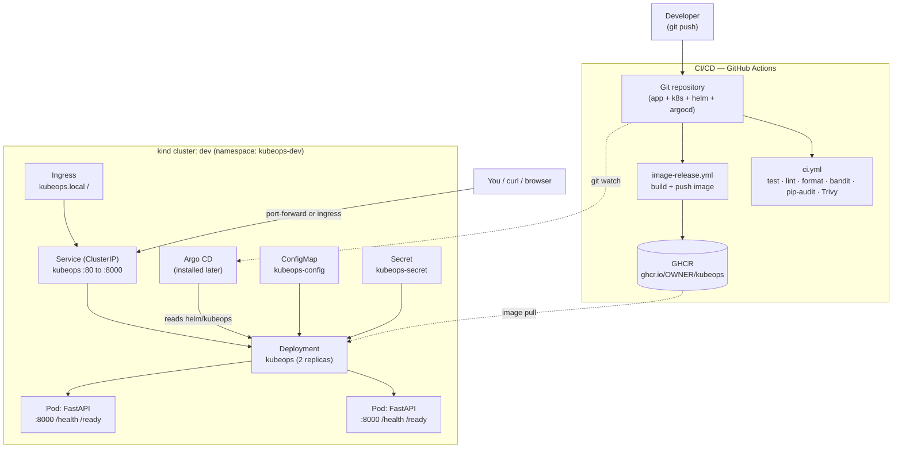

# KubeOps — GitOps-Based Kubernetes Deployment Platform

A **production-style Kubernetes and GitOps portfolio project** built around a
small, containerized FastAPI service called **KubeNotes**. The application is
intentionally simple — the real focus is the DevOps: Docker, Kubernetes
manifests, a Helm chart, an Argo CD GitOps workflow, operational scripts, and
honest documentation.

> This is a portfolio/learning project that runs on a **local kind cluster**.
> It is **not** an enterprise SaaS product, and it is not claiming to be
> production-hardened. See [Limitations](#limitations) for the honest list.

<!--
CI/CD STATUS BADGES
-------------------
The workflows live at .github/workflows/ci.yml and image-release.yml at the
repository root, so GitHub discovers and runs them automatically. The badges
below show live status after the first push to main.
-->

[](https://github.com/mehraxn/kubeops-gitops/actions/workflows/ci.yml)
[](https://github.com/mehraxn/kubeops-gitops/actions/workflows/image-release.yml)


---

## Overview

KubeNotes is a minimal notes API (`GET/POST/PUT/DELETE /notes`) with in-memory
storage. I use it as a realistic-but-simple payload so I can practice and show
the full path from source code to a Git-driven Kubernetes deployment:

- containerize the app with a non-root, healthchecked Docker image,
- deploy it two ways: **raw Kubernetes YAML** and a **configurable Helm chart**,
- describe a **GitOps** deployment with an Argo CD `Application` manifest,
- run everything locally on a **kind** cluster,
- and document operations, monitoring, security, and troubleshooting honestly.

## Why this project exists

I built this to demonstrate junior-level DevOps / Platform Engineering skills in
a way a recruiter can actually run:

- I wanted a repo that shows **Kubernetes fundamentals** (Deployment, Service,
  Ingress, ConfigMap, Secret, probes, resources, securityContext) without hiding
  behind a framework.
- I wanted to show **Helm** templating and multi-environment values.
- I wanted to show the **GitOps** idea (Argo CD watching Git) with a real
  manifest, while being honest that Argo CD itself is installed later.
- I kept the application deliberately tiny so the **infrastructure** is the star.

## Architecture



Data flows source → image → cluster. Argo CD reconciles the `helm/kubeops`
chart from Git into the `kubeops-dev` namespace. More detail in
[docs/architecture.md](docs/architecture.md).

## Tech stack

| Area          | Tools                                                                 |
| ------------- | --------------------------------------------------------------------- |
| Application   | Python 3.12, FastAPI, Uvicorn, Pydantic                               |
| Testing/QA    | pytest, httpx, ruff, black, isort, bandit, pip-audit                  |
| Container     | Docker (`python:3.12-slim`, non-root uid 1000), Docker Compose        |
| Kubernetes    | kind, kubectl, Deployment, Service, Ingress, ConfigMap, Secret, probes|
| Packaging     | Helm chart (`helm/kubeops`) with dev/prod values                      |
| GitOps        | Argo CD `Application` manifest (`argocd/application.yaml`)            |
| CI/CD         | GitHub Actions, GHCR, Trivy image scan                                |
| Scripting     | PowerShell scripts in `scripts/` (Windows-first)                      |

## API endpoints

| Method | Path          | Description                               |
| ------ | ------------- | ----------------------------------------- |
| GET    | `/health`     | Liveness → `{"status":"ok"}`              |
| GET    | `/ready`      | Readiness → `{"status":"ready"}`          |
| GET    | `/notes`      | List all notes                            |
| POST   | `/notes`      | Create a note (`201`, returns it + `id`)  |
| GET    | `/notes/{id}` | Get a note, or `404`                      |
| PUT    | `/notes/{id}` | Replace a note, or `404`                  |
| DELETE | `/notes/{id}` | Delete a note (`204`), or `404`           |

**Validation:** `title` is required, non-empty/non-whitespace, max 100 chars;
`content` is optional (defaults to `""`), max 1000 chars. Invalid input returns
`422`. Interactive docs are served by FastAPI at `/docs` and `/redoc`.

## Local Python setup

Requires Python 3.12 (tooling config targets 3.11+). From the project root:

```powershell
python -m venv .venv
.\.venv\Scripts\Activate.ps1
pip install -r requirements-dev.txt

python -m pytest          # run the test suite
ruff check .              # lint
black --check .           # formatting check
isort --check-only .      # import order check
bandit -r app             # Python security scan
pip-audit -r requirements.txt   # dependency vulnerability scan

uvicorn app.main:app --reload   # run at http://localhost:8000
```

A `Makefile` wraps the common commands (`make install`, `make test`,
`make lint`, `make format`, `make check`).

## Docker setup

```powershell
docker build -t kubeops:local .
docker run -d --name kubeops-test -p 8000:8000 kubeops:local
curl http://localhost:8000/health      # {"status":"ok"}
docker rm -f kubeops-test
```

Or with Docker Compose:

```powershell
docker compose up --build
# http://localhost:8000/health
```

The image runs as a non-root user (uid 1000), exposes port 8000, and has a
built-in `HEALTHCHECK` that hits `/health` using the Python stdlib.

## Raw Kubernetes deployment

Manifests live in [k8s/](k8s/): `namespace.yaml`, `configmap.yaml`,
`secret.example.yaml`, `deployment.yaml`, `service.yaml`, `ingress.yaml`.

```powershell
# Load your locally built image into kind so the cluster can use it:
kind load docker-image kubeops:local --name dev

# Create the real Secret from the example (kept out of Git):
Copy-Item k8s/secret.example.yaml k8s/secret.yaml
#   edit k8s/secret.yaml, then:
kubectl apply -f k8s/secret.yaml

kubectl apply -f k8s/
kubectl get pods,svc,ingress -n kubeops-dev
kubectl port-forward svc/kubeops 8000:80 -n kubeops-dev
curl http://localhost:8000/health
```

Helper scripts: [scripts/deploy-k8s.ps1](scripts/deploy-k8s.ps1),
[scripts/check-health.ps1](scripts/check-health.ps1),
[scripts/port-forward.ps1](scripts/port-forward.ps1). Full walkthrough in
[docs/kubernetes.md](docs/kubernetes.md).

## Helm deployment

The chart is in [helm/kubeops/](helm/kubeops/) with `values.yaml`,
`values-dev.yaml`, and `values-prod.yaml`.

```powershell
helm lint ./helm/kubeops
helm template kubeops ./helm/kubeops -f helm/kubeops/values-dev.yaml
helm install kubeops ./helm/kubeops -n kubeops-dev --create-namespace -f helm/kubeops/values-dev.yaml
helm upgrade kubeops ./helm/kubeops -n kubeops-dev -f helm/kubeops/values-dev.yaml
helm uninstall kubeops -n kubeops-dev
```

Or use [scripts/deploy-helm.ps1](scripts/deploy-helm.ps1) (lint + install/upgrade
+ show pods). Details, values reference, and rollback in [docs/helm.md](docs/helm.md).

## Argo CD / GitOps setup

The GitOps manifest is [argocd/application.yaml](argocd/application.yaml). It
targets the `helm/kubeops` chart at `targetRevision: main`, deploys into
`kubeops-dev`, and uses **manual sync by default** (the automated block is
commented out). Argo CD itself is **installed later** — this repo only provides
the manifest.

```powershell
# 1) Edit argocd/application.yaml and set repoURL to YOUR real repo.
# 2) Install Argo CD (see docs/gitops.md), then:
kubectl apply -f argocd/application.yaml
# 3) Sync manually from the Argo CD UI or CLI:
argocd app sync kubeops
```

Manual vs automated sync, installation, and rollback are covered in
[docs/gitops.md](docs/gitops.md).

## CI/CD explanation

Two workflows live in [.github/workflows/](.github/workflows/):

- **[`ci.yml`](.github/workflows/ci.yml)** (on push / pull_request): checkout →
  set up Python 3.12 (pip cache) → install dev deps → `ruff check` →
  `black --check` → `isort --check-only` → `pytest` → `bandit` → `pip-audit` →
  Docker build → Trivy image scan (fails on HIGH/CRITICAL).
- **[`image-release.yml`](.github/workflows/image-release.yml)** (on push to
  `main`, plus `workflow_dispatch`): checkout → log in to GHCR → build → tag with
  `latest` and the commit SHA → push to `ghcr.io/<owner>/kubeops` (lowercased) →
  Trivy scan.

> **Placement note:** GitHub only runs workflows from the repository **root**
> `.github/workflows/`. In this repo the app sits at the root, so both
> workflows are discovered and run automatically on push.

`image-release.yml` needs no extra secrets — it uses the built-in `GITHUB_TOKEN`
with `packages: write`. This project uses **GitOps (Argo CD)** for deployment, so
CI/CD stops at building/publishing the image — it does not push to a cluster.

## Monitoring

- `/health` (liveness) and `/ready` (readiness) back the Kubernetes probes.
- The app logs to **stdout** so `kubectl logs` works out of the box.
- Operational commands (`kubectl logs`, `describe`, `get events`) and the
  Prometheus/Grafana future plan are in [docs/monitoring.md](docs/monitoring.md)
  and [monitoring/README.md](monitoring/README.md).

## Security

Implemented: no committed secrets (`k8s/secret.yaml` is gitignored; only
`secret.example.yaml` is committed), non-root Docker user, Kubernetes
`securityContext` (`runAsNonRoot`, `allowPrivilegeEscalation: false`,
`readOnlyRootFilesystem: true`), resource requests/limits, and static analysis
via bandit, pip-audit, and Trivy (in CI). Full write-up and the honest list of
gaps: [docs/security.md](docs/security.md).

## Troubleshooting

Common failures (Docker not running, wrong kubectl context, `ImagePullBackOff`,
`CrashLoopBackOff`, pod not Ready, port-forward/ingress issues, Helm install
failures, Argo CD `OutOfSync`, GHCR pulls) with fixes:
[docs/troubleshooting.md](docs/troubleshooting.md).

## Limitations

- The API is intentionally simple.
- **Data is stored in memory and resets on every pod restart.** There is no
  database.
- The project focuses on Kubernetes/GitOps, not application complexity.
- The local **kind** cluster is not the same as managed cloud Kubernetes.
- **No authentication** is implemented.
- **No HTTPS** is configured by default.
- Argo CD manifests are provided, but **Argo CD is installed later** — it is not
  bundled here.
- **CI/CD workflows are committed but have not run yet** — they execute on GitHub
  after the first push (and only when this project is the repository root).
- Monitoring is documented at a basic level and can be expanded.

## Future improvements

- Add PostgreSQL (StatefulSet or managed) and persistent storage.
- Add a Prometheus `/metrics` endpoint and a Grafana dashboard JSON.
- Add release tagging/versioning (e.g. semver tags) on top of the GHCR publish.
- Add Argo CD Image Updater, cert-manager (HTTPS), and External Secrets Operator.
- Add a Horizontal Pod Autoscaler and NetworkPolicies.
- Add Terraform for cloud Kubernetes, Loki for logs, Cosign image signing,
  Dependabot, and policy checks (kube-score / kube-linter).

## Resume bullet points

- Built a GitOps-based Kubernetes deployment platform for a containerized FastAPI
  application using Docker, Helm, Argo CD manifests, and GitHub Actions.
- Created Kubernetes manifests and Helm charts with configurable image tags,
  environment variables, health probes, resource limits, ConfigMaps, Secrets,
  Services, and Ingress.
- Designed CI workflows for testing, linting, formatting checks, Python security
  scanning, Docker image building, Trivy image scanning, and GHCR publishing.
- Documented Kubernetes operations including local kind setup, Helm deployment,
  GitOps synchronization, health checks, logs, troubleshooting, security
  practices, and future production improvements.

## License

MIT © Mehran Bayat — see [LICENSE](LICENSE).
