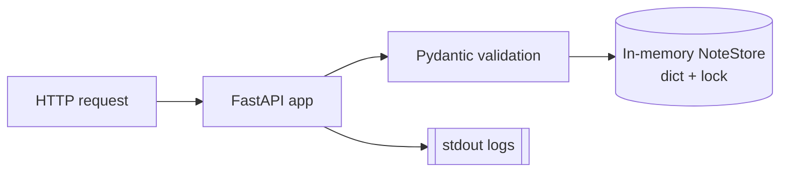
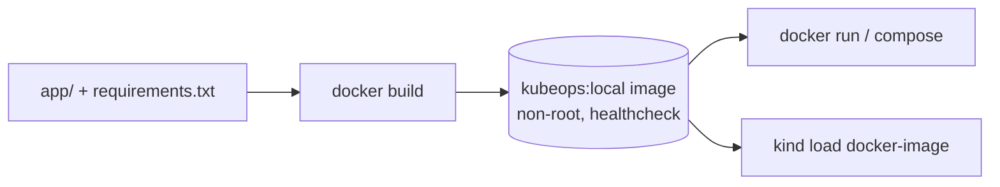
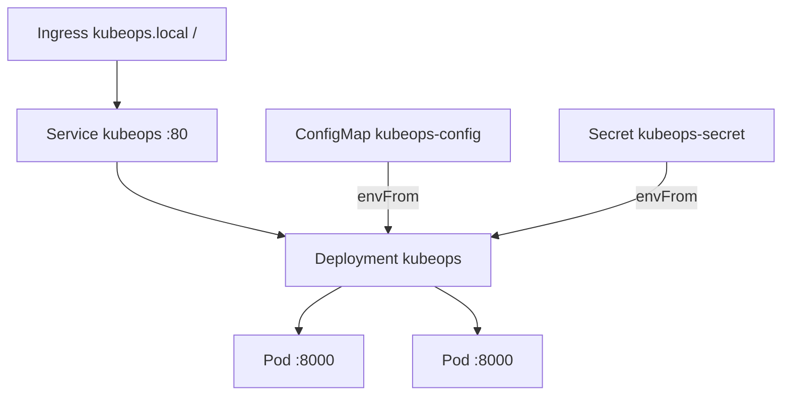
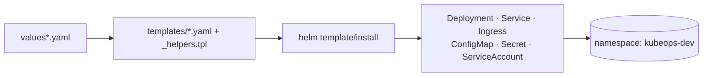
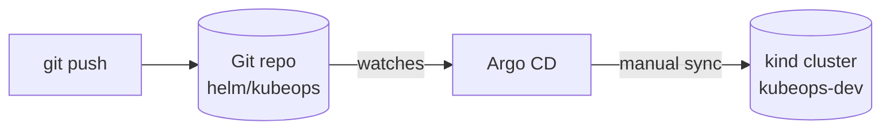

# Architecture

This document explains how the pieces of KubeOps fit together: the application,
the Docker image, the Kubernetes objects, the Helm chart, and the GitOps flow.
Everything described here matches what is actually in this repo.

## 1. Application flow

The app is a single FastAPI service ([app/main.py](../app/main.py)) with an
in-memory store.

- **Storage** is a `NoteStore` class: a `dict[int, Note]` guarded by a
  `threading.Lock`, with an auto-incrementing id. It lives in the process, so
  **all data is lost on restart**. This is intentional at this stage.
- **Models** ([app/models.py](../app/models.py)) use Pydantic. `title` is
  required (1–100 chars, non-whitespace), `content` is optional (max 1000).
  Bad input returns `422` automatically.
- **Settings** ([app/settings.py](../app/settings.py)) are read once from
  environment variables (`APP_ENV`, `LOG_LEVEL`, `APP_SECRET_KEY`) with safe
  defaults, so the app boots with zero configuration.
- **Logging** goes to **stdout** so container runtimes and `kubectl logs` can
  collect it.

Endpoints: `/health`, `/ready`, and CRUD under `/notes`. See the
[README](../README.md#api-endpoints) for the full table.

## 2. Docker flow

The [Dockerfile](../Dockerfile) builds a production-style image:

1. base `python:3.12-slim`,
2. install **only** `requirements.txt` (fastapi, uvicorn, pydantic) in a cached
   layer,
3. copy `app/`,
4. create and switch to a non-root user (uid 1000),
5. expose port 8000,
6. `HEALTHCHECK` hits `/health` using the Python stdlib (no curl needed),
7. run `uvicorn app.main:app --host 0.0.0.0 --port 8000`.

[docker-compose.yml](../docker-compose.yml) builds the same image as
`kubeops:local` and maps port 8000 for local development.

## 3. Kubernetes flow

Raw manifests in [k8s/](../k8s/) create everything in the `kubeops-dev`
namespace:

- **Deployment** `kubeops` — 2 replicas, container port 8000, liveness on
  `/health`, readiness on `/ready`, resource requests/limits, a hardened
  `securityContext` (including `readOnlyRootFilesystem: true`), and environment
  injected via `envFrom` from a ConfigMap and a Secret.
- **Service** `kubeops` — `ClusterIP`, port 80 → targetPort 8000.
- **Ingress** `kubeops` — host `kubeops.local`, path `/`, backend `kubeops:80`.
- **ConfigMap** `kubeops-config` — `APP_ENV`, `LOG_LEVEL`.
- **Secret** `kubeops-secret` — from `secret.example.yaml` (placeholder only).

Details and commands: [docs/kubernetes.md](kubernetes.md).

## 4. Helm flow

The chart in [helm/kubeops/](../helm/kubeops/) renders the same set of objects
from templates + values, so one chart serves multiple environments:

- `values.yaml` — defaults (2 replicas, `kubeops:local`, probes, resources,
  securityContext, service, ingress, rendered Secret).
- `values-dev.yaml` — dev overrides (kind, `kubeops.local`, `LOG_LEVEL: DEBUG`).
- `values-prod.yaml` — prod-shaped overrides (3 replicas,
  `ghcr.io/mehraxn/kubeops`, `nginx` ingress class, `existingSecret` instead of a
  rendered one). Note: this is an aspirational example — the GHCR image isn't
  published until the `image-release.yml` workflow runs on a push to `main`.

Templates use helper functions in `_helpers.tpl` for names and labels. The
Secret and Ingress templates are conditional (`secret.create`,
`ingress.enabled`).

Details: [docs/helm.md](helm.md).

## 5. GitOps flow

GitOps means **Git is the source of truth** for what runs in the cluster. Argo
CD (installed later) watches this repo and reconciles the `helm/kubeops` chart
into `kubeops-dev`.

- [argocd/application.yaml](../argocd/application.yaml) defines an Argo CD
  `Application`: `repoURL` (placeholder you must replace), `path: helm/kubeops`,
  `targetRevision: main`, values `values-dev.yaml`, destination
  `https://kubernetes.default.svc` / `kubeops-dev`.
- **Manual sync** is the default (the `automated:` block is commented out).
  `syncOptions: CreateNamespace=true` is active so the namespace is created on
  first sync.

Details: [docs/gitops.md](gitops.md).
